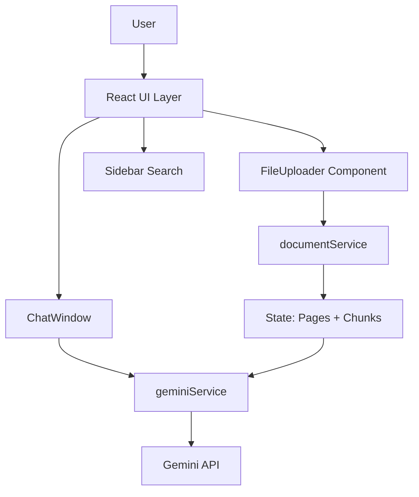

# DocuMind

**Client-side AI-powered Document Intelligence**

Upload PDFs, DOCX, or TXT files and chat with your documents instantly using Retrieval-Augmented Generation (RAG) powered by Google's Gemini.

---

## Features

- Multi-format support: PDF, DOCX, and TXT
- Automatic text extraction and semantic chunking
- AI-powered document summarization
- Real-time conversational Q&A with source citations
- Client-side keyword search with highlighting
- Clean, modern UI with sidebar (Overview & Search)
- Progress tracking and easy file reset

---

## Tech Stack

| Category           | Technology                  |
|--------------------|-----------------------------|
| Frontend           | React 19 + TypeScript       |
| Build Tool         | Vite                        |
| Styling            | Tailwind CSS                |
| Icons              | Lucide React                |
| PDF Processing     | pdfjs-dist                  |
| DOCX Processing    | mammoth                     |
| AI                 | Google Gemini (@google/genai) |
| Architecture       | Client-side RAG             |

---

## Project Structure

```bash
/
├── App.tsx                    # Main app with state management
├── components/
│   ├── FileUploader.tsx
│   └── ChatWindow.tsx
├── services/
│   ├── documentService.ts     # File processing & chunking
│   └── geminiService.ts       # RAG and Gemini API calls
├── types.ts                   # Type definitions
├── vite.config.ts
└── index.html
```

---

## Architecture



---

## How It Works

1. Upload a document (PDF, DOCX, or TXT)
2. Text is automatically extracted and chunked
3. Gemini generates an initial document summary
4. Ask any question in the chat interface
5. Relevant chunks are retrieved and sent to Gemini
6. Receive accurate answers with citations to the source

---

## Core Concepts

- **Client-side Processing**: All operations run in the browser for maximum privacy
- **RAG (Retrieval-Augmented Generation)**: Ensures answers are grounded in the uploaded document
- **Semantic Chunking**: Breaks documents into meaningful pieces for better context
- **Hybrid Search**: Combines keyword search and semantic retrieval

---

## Summary

DocuMind is a modern, privacy-first document intelligence tool built as a single-page React application. It brings the power of AI directly into the browser, allowing users to interact naturally with their documents without uploading data to external servers.

**Perfect for researchers, students, analysts, and knowledge workers.**
```