**Here's the clean Markdown version** perfect for your GitHub repository's `README.md`:

```markdown
# DocuMind

**Client-side AI-Powered Document Intelligence**  
Upload PDFs, DOCX, or TXT files and instantly chat with your documents using **Gemini + RAG** — all running in your browser.


## ✨ Features

- **Multi-format Support**: PDF (pdf.js), DOCX (mammoth), TXT
- **Automatic Summarization** using Google Gemini
- **Conversational Q&A** with source citations (RAG)
- **Client-side Keyword Search** with highlighting
- **Semantic Chunking** for better context understanding
- **Modern, Clean UI** with sidebar (Overview + Search)
- **Progress tracking** and one-click reset
- **Zero Backend** — Maximum privacy

## 🎯 Problem It Solves

Long documents (research papers, contracts, reports, manuals) are hard to digest quickly. Traditional search is imprecise and lacks understanding. DocuMind gives you an intelligent conversational interface over any document.

## 🛠 Tech Stack

| Layer                | Technology                          |
|----------------------|-------------------------------------|
| **Frontend**         | React 19 + TypeScript, Vite         |
| **Styling**          | Tailwind CSS                        |
| **Icons**            | Lucide React                        |
| **PDF Processing**   | pdfjs-dist                          |
| **DOCX Processing**  | mammoth                             |
| **AI**               | @google/genai (Gemini)              |
| **Architecture**     | Client-side RAG                     |

## 📁 Project Structure

```bash
/
├── App.tsx                     # Main container & state management
├── components/
│   ├── FileUploader.tsx
│   ├── ChatWindow.tsx
│   └── ui/Layout.tsx
├── services/
│   ├── documentService.ts      # Extraction, chunking, search
│   └── geminiService.ts        # RAG + Gemini calls
├── types.ts                    # TypeScript interfaces
├── vite.config.ts
└── index.html                  # Tailwind CDN
```

## 🚀 How It Works

1. Upload a document → Text extraction + intelligent chunking
2. Gemini generates initial document summary/briefing
3. Ask questions in natural language
4. **RAG pipeline**: Retrieve relevant chunks → Send to Gemini → Answer with citations
5. Sidebar keyword search with live highlighting

## 🧠 Architecture

```mermaid
graph TD
    A[User] --> B[React UI]
    B --> C[File Upload]
    C --> D[Document Service]
    D --> E[Pages + Chunks]
    B --> F[Chat Interface]
    F --> G[Gemini Service]
    G --> H[Gemini API]
    E --> G
    B --> I[Client-side Search]
```



## 🔑 Key Concepts

- **Chunking**: Breaks documents into manageable semantic pieces
- **RAG (Retrieval-Augmented Generation)**: Grounds LLM responses in your document
- **Client-side Processing**: Documents never leave your browser
- **Hybrid Search**: Keyword + Semantic retrieval

## 🚧 Limitations

- Browser memory limits for very large documents
- Gemini API rate limits
- No persistent storage (in-memory only)

## 🔮 Future Improvements

- Client-side vector embeddings (`@xenova/transformers`)
- Web Workers for better performance
- Multi-document chat
- Voice input/output
- PWA support
- Export conversations & citations

## 🧪 Ideal For

- Researchers & Students
- Legal & Compliance Teams
- Knowledge Workers
- Anyone who works with dense documents

---

**DocuMind** — *Your personal AI document assistant that actually reads and understands your files.*

Made with ❤️ using React, TypeScript & Gemini.
```

---

**How to use:**

1. Copy everything above
2. Create `README.md` in your project root
3. Paste it
4. (Optional) Replace the placeholder image with a real screenshot

Would you like a version with badges, installation instructions, or deployment guide added?