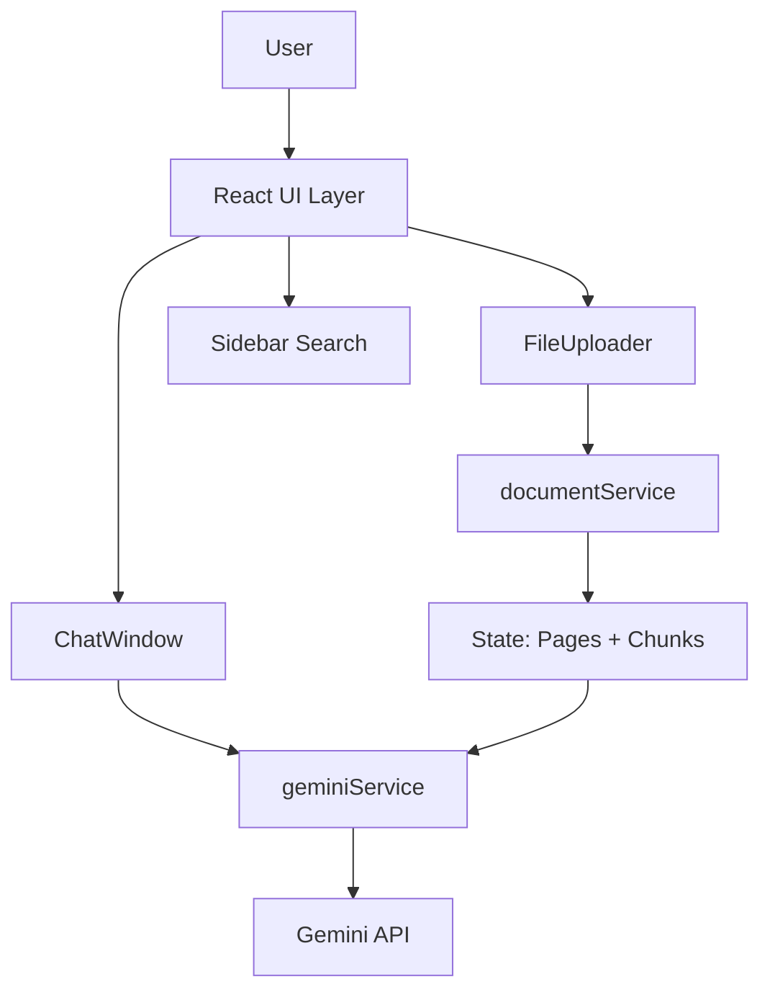

<div align="center">

# DocuMind

**A real RAG pipeline, running in the browser.**

Upload a PDF, DOCX, or TXT. DocuMind extracts it, chunks it, retrieves the relevant passages, and answers with Gemini — grounded in the file, with citations.

<br />

[](https://react.dev/)
[](https://www.typescriptlang.org/)
[](https://vite.dev/)
[](https://tailwindcss.com/)
[](https://ai.google.dev/)

</div>

---

## What it does

DocuMind is a client-side document intelligence app. The model does not answer from memory. Every question goes through a retrieval-augmented generation pipeline: the file is parsed in the browser, split into chunks, and only the passages that match the question are sent to Gemini with the prompt.

```text
upload → extract → chunk → summarize → retrieve → augment → generate → cite
```

<p align="center">
  
</p>

<p align="center">
  <sub>Chat grounded in the uploaded document, with overview and in-file search</sub>
</p>

---

## The RAG pipeline

This is the pipeline, not a chat box wrapped around an API.

| Stage | What runs | Where |
| --- | --- | --- |
| **Ingest** | PDF, DOCX, or TXT upload | `FileUploader.tsx` |
| **Extract** | Text pulled from the file | `documentService.ts` · pdfjs-dist, mammoth |
| **Chunk** | Semantic chunks with local context kept intact | `documentService.ts` |
| **Index** | Pages and chunks held in app state, ready to retrieve | `App.tsx` |
| **Summarize** | First-pass overview of the whole document | `geminiService.ts` |
| **Retrieve** | Relevant chunks selected for the question | `geminiService.ts` |
| **Augment** | Retrieved passages attached to the prompt | `geminiService.ts` |
| **Generate** | Gemini answers from that context | Google Gemini (`@google/genai`) |
| **Cite** | Answer returned with source citations | `ChatWindow.tsx` |

Keyword search sits beside retrieval. The sidebar finds exact terms and highlights them. Questions use semantic retrieval, then generation. Together that is the hybrid search path.


```mermaid
graph TD
    A[User] --> B[React UI Layer]
    B --> C[FileUploader]
    C --> D[documentService]
    D --> E[State: Pages + Chunks]
    B --> F[ChatWindow]
    F --> G[geminiService]
    G --> H[Gemini API]
    E --> G
    B --> I[Sidebar Search]
```

---

## Features

- **Multi-format support.** PDF, DOCX, and TXT.
- **Automatic text extraction and semantic chunking.** The file is split into meaningful pieces before any question is asked.
- **AI document summary.** Gemini writes an overview as soon as the chunks are ready.
- **Conversational Q&A with citations.** Each answer is tied back to the source passages.
- **Client-side keyword search with highlighting.** Find a term in the sidebar without leaving the page.
- **Overview and Search sidebar.** Summary on one side, direct search on the other.
- **Progress tracking and reset.** Clear status while a file processes, and a clean way to start over.

---

## How a question is answered

1. Upload a document (PDF, DOCX, or TXT).
2. Text is extracted and chunked in the browser.
3. Gemini generates the initial summary from that document.
4. Ask anything in the chat.
5. Relevant chunks are retrieved and sent to Gemini with the question.
6. The answer comes back with citations to the source.

---

## Core concepts

- **Client-side processing.** Extraction, chunking, and keyword search run in the browser.
- **RAG.** Answers are generated from retrieved passages, not from the model alone.
- **Semantic chunking.** Documents are broken into pieces that keep enough context for a useful retrieval.
- **Hybrid search.** Keyword search for exact matches, semantic retrieval for questions.

---

## Stack

| Layer | Choice |
| --- | --- |
| Frontend | React 19 + TypeScript |
| Build | Vite |
| Styling | Tailwind CSS |
| Icons | Lucide React |
| PDF | pdfjs-dist |
| DOCX | mammoth |
| Model | Google Gemini (`@google/genai`) |
| Architecture | Client-side RAG |

---

## Project layout

```text
/
├── App.tsx                      # state: pages, chunks, chat
├── components/
│   ├── FileUploader.tsx         # ingest
│   └── ChatWindow.tsx           # questions, answers, citations
├── services/
│   ├── documentService.ts       # extract and chunk
│   └── geminiService.ts         # retrieve, augment, generate
├── types.ts
├── vite.config.ts
└── index.html
```

---

## Run it

```bash
git clone <your-repo-url>
cd documind
npm install
npm run dev
```

Add a Gemini API key, open the Vite URL, and upload a document.

---

DocuMind is a privacy-first document intelligence app: a single-page React client with a full RAG pipeline in front of Gemini. Built for researchers, students, analysts, and anyone who wants to talk to a file instead of skimming it.
